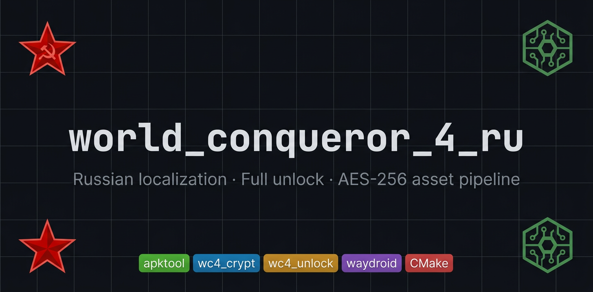

# world_conqueror_4_ru

<p align="center">
  
</p>

Russian localization and full-unlock patch pipeline for **World Conqueror 4** (EasyTech).  
Decompile the APK → edit string tables + data JSON → recompile → sign → sideload on Waydroid.

## Prerequisites

| Tool | Version | Install |
|---|---|---|
| Java | 11+ | `sudo apt install default-jdk` |
| Python | 3.12+ | system |
| `cryptography` | any | `pip install cryptography` |
| CMake | 4.2+ | cmake.org |
| apktool | 3.0.1 | auto-downloaded |
| uber-apk-signer | 1.3.0 | auto-downloaded |
| Waydroid | any | for deploy target only |

## Quick Start

```bash
# 1. configure (downloads apktool + uber-apk-signer JARs on first run)
cmake --preset default -Dapk_input=/path/to/wc4.apk -Dapk_pkg=com.easytech.wc4

# 2. decompile + decrypt all assets/data/*.json into src/
cmake --build build --target update

# 3. patch string tables and data
#    edit src/ freely here — JSON is plaintext after update

# 4. recompile + encrypt + sign
cmake --build build --target build
#    => build/work/patched-aligned-debugSigned.apk

# 5. (optional) push to Waydroid
cmake --build build --target deploy
```

## CMake Targets

| Target | What it does |
| :-- | :-- |
| `update` | `apktool d` → `src/`; then batch-decrypt `assets/data/*.json` in-place |
| `build` | stage `src/` → batch-encrypt JSON → `apktool b` → sign |
| `deploy` | runs `build` then installs via `waydroid app install` |

## CMake Cache Variables

| Variable | Default | Description |
| :-- | :-- | :-- |
| `apk_input` | `` | Path to the original `.apk` |
| `apk_pkg` | `` | Android package name (e.g. `com.easytech.wc4`) |
| `java_bin` | `java` | Java executable |
| `python3_bin` | `python3` | Python 3 executable |
| `apktool_version` | `3.0.1` | apktool JAR version to download |
| `uber_signer_version` | `1.3.0` | uber-apk-signer JAR version |
| `wc4_crypt` | `scripts/wc4_crypt.py` | Encryption script path |
| `wc4_header` | `MD5_SIZE` | Header format used when re-encrypting |
| `src_dir` | `src/` | Decompiled smali + assets tree |

Override at configure time:

```bash
cmake --preset default \
  -Dapk_input=~/Downloads/wc4.apk \
  -Dapk_pkg=com.easytech.wc4
```

## Encryption (`scripts/wc4_crypt.py`)

AES-256-CBC, key/IV extracted from `libworld-conqueror-4.so`.
All `assets/data/*.json` are encrypted blobs. The script handles five header formats:

| Format | Layout |
| :-- | :-- |
| `EASY_MD5_SIZE` | `EASY(4) + ver(4) + len(4) + md5(16) + origsize(4) + ct` |
| `EASY_MD5` | `EASY(4) + ver(4) + len(4) + md5(16) + ct` |
| `MD5_SIZE` | `md5(16) + origsize(4) + ct` ← default for re-encrypt |
| `MD5` | `md5(16) + ct` |
| `RAW` | `ct` only |

Auto-detection probes each format and validates UTF-8/JSON output.

### Standalone usage

```bash
# inspect a file
python3 scripts/wc4_crypt.py info ArmySettings.json

# decrypt to plaintext
python3 scripts/wc4_crypt.py decrypt ArmySettings.json -o army.json --pretty

# re-encrypt (auto-detects original header format)
python3 scripts/wc4_crypt.py encrypt army.json -o ArmySettings.json --ref ArmySettings.json.orig

# batch decrypt a directory
python3 scripts/wc4_crypt.py decrypt assets/data/ -o decrypted/

# query a JSON path (works on encrypted files directly)
python3 scripts/wc4_crypt.py query ArmySettings.json 'units.0.name'
python3 scripts/wc4_crypt.py query ArmySettings.json 'units.*.attack'

# in-place field edit + re-encrypt
python3 scripts/wc4_crypt.py edit ArmySettings.json \
  --set 'units.0.hp=9999' --encrypt -o ArmySettings.json

# regex substitution
python3 scripts/wc4_crypt.py edit plain.json \
  --regex '/OldText/NewText/' -o patched.json

# search across all data files
python3 scripts/wc4_crypt.py grep assets/data/ -p 'tank' --glob '*.json'

# verify md5 integrity of all files
python3 scripts/wc4_crypt.py verify assets/data/

# roundtrip test (encrypt → decrypt → compare)
python3 scripts/wc4_crypt.py roundtrip ArmySettings.json
```

## Full Unlock (`scripts/wc4_unlock.py`)

Patches **all JSON data files in-place** (plaintext `src/assets/data/`) to unlock everything.
Does **not** touch stat/combat values. Does **not** modify `ScenarioSettings.json`.

```bash
python3 scripts/wc4_unlock.py src/assets/data/
```

What gets patched (25 categories):

- **Generals** — all stats capped at 6, skills at 5, `CostMedal=1`, `CostGold=0`, all shops unlocked, all set legendary (orange)
- **General promotions** — promotion chain costs zeroed; `AdvanceID` linked-list preserved
- **Skills** — `CostMedal=1`, all unlocked by default, stage/scenario gates removed
- **Technology** — all costs zeroed, HQ requirements removed
- **Stages / Campaigns** — all opened, HQ locks removed; tutorial mission (Id=10001) grants 10M exp + 1M medals + unlocks all stages
- **Conquests** — all visible and open, country costs zeroed
- **Army purchase** — `CostMoney=1`, gear/atomic costs zeroed, build time/CD zeroed
- **Buildings, Wonders, Legion, Corps, Elite Army, Frontier, Decorations, HQ, Shop** — costs minimized, locks cleared

## Font Patch (`scripts/patch_lang_notosans.py`)

Replaces the in-APK font with **Noto Sans** to fix Cyrillic rendering after localization.

```bash
python3 scripts/patch_lang_notosans.py src/
```

Run after `update`, before `build`.

## Spec Dump (`scripts/wc_spec_dump.py`)

Dumps unit/general stats from decrypted JSON into human-readable tables for analysis.

```bash
python3 scripts/wc_spec_dump.py src/assets/data/ -o specs.md
```

## Typical Patch Workflow

```bash
cmake --preset default -Dapk_input=~/wc4.apk -Dapk_pkg=com.easytech.wc4
cmake --build build --target update              # decompile + decrypt
python3 scripts/wc4_unlock.py src/assets/data/  # unlock everything
python3 scripts/patch_lang_notosans.py src/      # fix Cyrillic font
# edit src/assets/strings/strings.xml for RU strings
cmake --build build --target build               # encrypt + recompile + sign
cmake --build build --target deploy              # push to Waydroid
```

## Project Structure

```
.
├── CMakeLists.txt               # build pipeline (LANGUAGES NONE)
├── CMakePresets.json            # default configure/build presets
├── scripts/
│   ├── wc4_crypt.py             # AES-256-CBC encrypt/decrypt toolkit
│   ├── wc4_unlock.py            # full-unlock patcher (25 categories)
│   ├── patch_lang_notosans.py   # Cyrillic font patch
│   └── wc_spec_dump.py          # unit/general stat extractor
├── src/                         # decompiled APK tree (after `update`)
│   └── assets/data/             # encrypted *.json game data
└── schemas/                     # JSON schemas for data files
```

## Saves

Save files are stored in **public external storage** (required for Android SDK 35 target).
On first launch after update, saves are migrated automatically from the old location.
**Export your saves before updating** — use the in-game export function.

## Releases

| Version | Date | Notes |
| :-- | :-- | :-- |
| `v1.24.2_ru2` | 2026-03-22 | Save export support, GDPR crash fix, overbuf mod fix, translation fixes |
| `v1.24.2_ru1` | 2026-03-15 | Initial public release |

## License

MIT — see [`license`](license).
