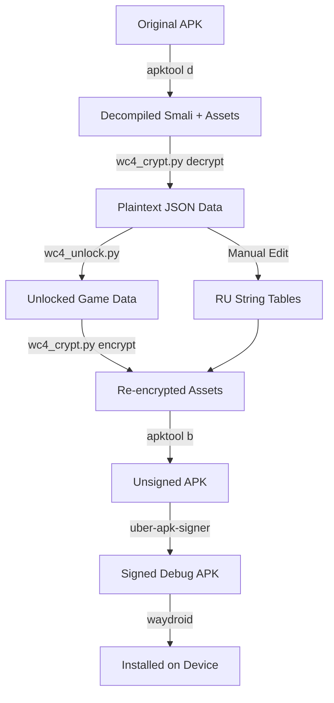
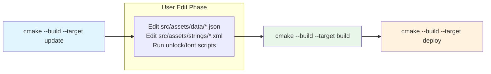

<div align="center">

# World Conqueror 4 — Russian Localization & Unlock Patch

**A CMake-driven reverse-engineering pipeline for patching, localizing, and unlocking World Conqueror 4 (Android).**

[](./license)
[](https://cmake.org)
[](https://python.org)

</div>

---

## Overview

This repository provides a complete toolchain for:

1. **Decompiling** the World Conqueror 4 APK.
2. **Decrypting** its encrypted JSON game-data blobs.
3. **Patching** strings for Russian localization.
4. **Unlocking** all in-game content (generals, stages, conquests, tech, etc.).
5. **Recompiling, signing, and deploying** the modified APK.

The entire workflow is orchestrated through CMake targets so that every step is reproducible, scriptable, and idempotent.

---

## Architecture



---

## Features

| Capability | Tool | Detail |
|---|---|---|
| **APK De/Re-compilation** | `apktool` | Automated via CMake; version pinned to `3.0.1`. |
| **AES-256-CBC Crypto** | `wc4_crypt.py` | Auto-detects 5 header variants; supports encrypt, decrypt, query, edit, grep, verify. |
| **Full Content Unlock** | `wc4_unlock.py` | Patches 25 JSON categories in-place. Zeroes costs, removes HQ locks, preserves stat balance. |
| **Cyrillic Font Fix** | `patch_lang_notosans.py` | Replaces the built-in font with Noto Sans for proper Russian rendering. |
| **Stat Dump** | `wc_spec_dump.py` | Exports unit/general stats to Markdown tables for analysis. |
| **Deploy Target** | `waydroid` | One-command install after signing. |

---

## Prerequisites

| Dependency | Minimum Version | Installation |
|---|---|---|
| Java | 11+ | `sudo apt install default-jdk` |
| Python | 3.12 | System package or `pyenv` |
| `cryptography` | Any | `pip install cryptography` |
| CMake | 4.2 | [cmake.org](https://cmake.org) |
| apktool | 3.0.1 | **Auto-downloaded** by CMake |
| uber-apk-signer | 1.3.0 | **Auto-downloaded** by CMake |
| Waydroid | Any | Only required for the `deploy` target |

---

## Quick Start

```bash
# 1. Configure (downloads apktool & signer automatically)
cmake --preset default \
  -Dapk_input=/path/to/wc4.apk \
  -Dapk_pkg=com.easytech.wc4

# 2. Decompile + decrypt
cmake --build build --target update

# 3. Apply full unlock + font patch
python3 scripts/wc4_unlock.py build/src/assets/data/
python3 scripts/patch_lang_notosans.py build/src/

# 4. Recompile, encrypt, and sign
cmake --build build --target build

# 5. Install on Waydroid
cmake --build build --target deploy
```

> **Output:** `build/wc4_ru-aligned-debugSigned.apk` and/or `wc4_ru_mod-aligned-debugSigned.apk`

---

## Build Targets



| Target | Purpose | Idempotent |
|---|---|---|
| `update` | Decompiles the APK and decrypts `assets/data/*.json` into `src/`. | Yes |
| `build` | Stages `src/`, re-encrypts JSON, recompiles the APK, and signs it. | Yes |
| `deploy` | Runs `build`, then pushes both RU and MOD variants to Waydroid. | Yes |

---

## CMake Options

| Variable | Default | Description |
|---|---|---|
| `apk_input` | *(empty)* | Path to the original `.apk`. If omitted, the build auto-downloads the baseline APK from releases. |
| `apk_pkg` | *(empty)* | Android package name, e.g. `com.easytech.wc4`. |
| `java_bin` | `java` | Java executable name or path. |
| `python3_bin` | `python3` | Python 3 executable name or path. |
| `apktool_version` | `3.0.1` | Pin for the apktool JAR. |
| `uber_signer_version` | `1.3.0` | Pin for the signer JAR. |
| `wc4_header` | `MD5_SIZE` | Header format used when re-encrypting game data. |

---

## Tooling Reference

### `scripts/wc4_crypt.py` — Encryption Engine

The game stores all `assets/data/*.json` as AES-256-CBC encrypted blobs. The script handles five header formats and supports both interactive and batch operations.

**Supported formats:**

| Format | Structure |
|---|---|
| `EASY_MD5_SIZE` | `EASY(4) + ver(4) + len(4) + md5(16) + origsize(4) + ct` |
| `EASY_MD5` | `EASY(4) + ver(4) + len(4) + md5(16) + ct` |
| `MD5_SIZE` | `md5(16) + origsize(4) + ct` *(default for re-encryption)* |
| `MD5` | `md5(16) + ct` |
| `RAW` | `ct` only |

**Common commands:**

```bash
# Decrypt a single file
python3 scripts/wc4_crypt.py decrypt ArmySettings.json -o army.json --pretty

# Batch decrypt an entire directory
python3 scripts/wc4_crypt.py decrypt assets/data/ -o decrypted/

# Query a field without writing to disk (works on encrypted files)
python3 scripts/wc4_crypt.py query ArmySettings.json 'units.0.name'

# Edit a field in-place
python3 scripts/wc4_crypt.py edit ArmySettings.json \
  --set 'units.0.hp=9999' --encrypt -o ArmySettings.json

# Verify integrity across all files
python3 scripts/wc4_crypt.py verify assets/data/

# Roundtrip test
python3 scripts/wc4_crypt.py roundtrip ArmySettings.json
```

### `scripts/wc4_unlock.py` — Full Unlock Patcher

Patches all plaintext JSON data files inside `src/assets/data/` to remove progression locks. **Does not alter combat stats.**

```bash
python3 scripts/wc4_unlock.py src/assets/data/
```

**Categories patched (25 total):**

- **Generals** — stats → 6, skills → 5, costs → 1 medal / 0 gold, all legendary.
- **Promotions** — zeroed costs; `AdvanceID` linked-list preserved.
- **Skills** — 1 medal, unlocked by default, stage/scenario gates removed.
- **Technology** — costs zeroed, HQ requirements removed.
- **Stages / Campaigns** — all opened; tutorial (Id=10001) grants 10M EXP + 1M medals.
- **Conquests** — all visible, country costs zeroed.
- **Army Purchase** — 1 money, zero gear/atomic/build-time.
- **Facilities, Wonders, Legion, Corps, Elite, Frontier, HQ, Shop** — costs minimized, locks cleared.

### `scripts/patch_lang_notosans.py` — Font Patch

Replaces the APK's original font with Noto Sans so Cyrillic glyphs render correctly.

```bash
python3 scripts/patch_lang_notosans.py src/
```

Run after `update`, before `build`.

### `scripts/wc_spec_dump.py` — Stat Extractor

Generates human-readable Markdown tables from decrypted JSON for spreadsheet-style analysis.

```bash
python3 scripts/wc_spec_dump.py src/assets/data/ -o specs.md
```

---

## Project Layout

```
world_conqueror_4_ru/
├── CMakeLists.txt                 # Build orchestration (LANGUAGES NONE)
├── CMakePresets.json              # Default configure / build presets
├── scripts/
│   ├── wc4_crypt.py               # AES-256-CBC toolkit
│   ├── wc4_unlock.py              # Full-unlock patcher
│   ├── patch_lang_notosans.py     # Cyrillic font replacement
│   └── wc_spec_dump.py            # Stat dump → Markdown
├── diff/                          # RU translation overlay (vs vanilla)
├── diff_mod/                      # Unlock delta (auto-generated)
├── schemas/                       # JSON schemas for game data files
├── src/                           # Decompiled APK tree (gitignored, created by update)
└── build/                         # CMake build directory (gitignored)
```

---

## Typical Development Workflow

```bash
# --- Phase 1: Setup ---
cmake --preset default -Dapk_input=~/wc4.apk -Dapk_pkg=com.easytech.wc4

# --- Phase 2: Decompile & Decrypt ---
cmake --build build --target update

# --- Phase 3: Patch (customize here) ---
python3 scripts/wc4_unlock.py build/src/assets/data/   # full unlock
python3 scripts/patch_lang_notosans.py build/src/      # font fix
# ... edit build/src/assets/strings/*.xml for RU text ...

# --- Phase 4: Build & Sign ---
cmake --build build --target build

# --- Phase 5: Deploy ---
cmake --build build --target deploy
```

---

## Save Data

- Save files are stored in **public external storage** (Android 11+ scoped-storage requirement).
- On first launch, the game automatically migrates saves from the legacy path.
- **Always export saves via the in-game export function before reinstalling.**

---

## Releases

| Version | Date | Highlights |
|---|---|---|
| `v1.24.2_ru2` | 2026-03-22 | Save-export support, GDPR crash fix, overbuf mod fix, translation fixes |
| `v1.24.2_ru1` | 2026-03-15 | Initial public release |

---

## Troubleshooting

| Symptom | Likely Cause | Fix |
|---|---|---|
| `cryptography module missing` | Python dependency not installed | `pip install cryptography` |
| `apktool d` fails | APK path is wrong or contains spaces | Quote the path: `-Dapk_input="/path/to/wc4.apk"` |
| Font shows squares instead of Cyrillic | Font patch not applied | Run `patch_lang_notosans.py` before `build` |
| Waydroid install hangs | Session not started | `waydroid session start` manually, then retry `deploy` |
| Re-encrypted JSON crashes game | Wrong header format selected | Use the default `wc4_header=MD5_SIZE`; verify with `roundtrip` |

---

## License

MIT — see [`license`](license).

---

<div align="center">
  <sub>Built for the reverse-engineering and modding community. Not affiliated with EasyTech.</sub>
</div>
